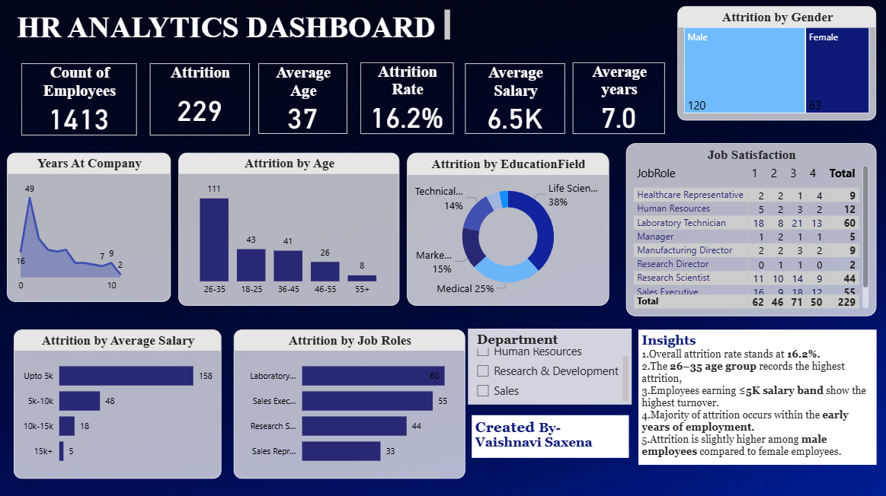

#  HR Analytics Dashboard – Employee Attrition Analysis

---

##  Project Overview

This interactive **Power BI dashboard** analyzes employee attrition trends across departments, job roles, salary bands, age groups, education fields, and years at company.

The objective of this project is to identify key attrition drivers and provide actionable HR insights to improve employee retention strategies.

---

##  Key Performance Indicators (KPIs)

- **Total Employees:** 1,413  
- **Total Attrition:** 229  
- **Attrition Rate:** 16.2%  
- **Average Age:** 37 Years  
- **Average Salary:** 6.5K  
- **Average Years at Company:** 7 Years  

---

##  Key Business Insights

- Highest attrition observed in the **26–35 age group (111 employees)**.
- Employees earning **Up to 5K salary band (158 employees)** show the highest turnover.
- **Laboratory Technicians (60)** and **Sales Executives (55)** have the highest attrition among job roles.
- Majority of attrition occurs during the early years at the company.
- Attrition is slightly higher among **male employees (120)** compared to female employees (63).

---

##  Tools & Technologies Used

- Power BI  
- DAX (Data Analysis Expressions)  
- Data Cleaning & Transformation  
- Data Modeling  
- Data Visualization  

---

##  Dashboard Features

- Interactive department slicer  
- Dynamic KPI cards  
- Attrition breakdown by:
  - Age Group  
  - Salary Band  
  - Job Role  
  - Education Field  
  - Gender  
  - Years at Company  

---

##  Business Impact

This dashboard helps HR teams:

- Identify high-risk employee segments  
- Improve retention strategies  
- Optimize workforce planning  
- Enable data-driven decision making  

---

##  Future Enhancements

- Predictive attrition modeling  
- Drill-through analysis  
- Department-level performance insights

##  Author  
**Vaishnavi Saxena**    
